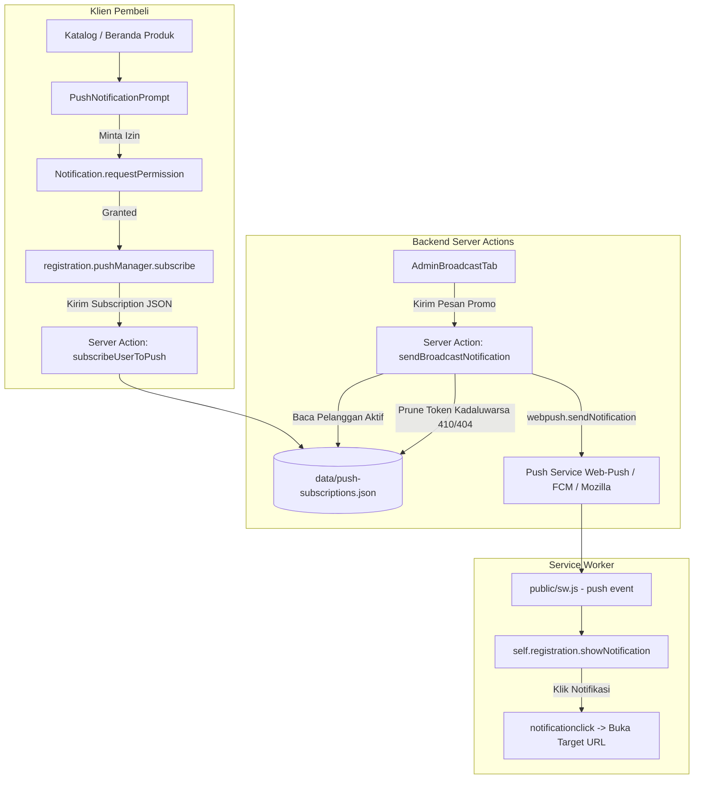

# Rencana Implementasi: Web Push Notification Native & Panel Broadcast Promo

Implementasi sistem **Web Push Notification Native** dan **Panel Broadcast Promo** pada marketplace Mas Chan Digital memungkinkan Super Admin mengirim siaran informasi promo, diskon, dan produk baru UMKM Kota Serang secara langsung ke layar ponsel pintar (Android/iOS PWA) para pembeli secara real-time.

---

## 🎯 Komponen & Alur Arsitektur



---

## 📂 Berkas yang Akan Dibuat & Dimodifikasi

### 1. Kunci VAPID & Lingkungan
#### [NEW] [`.env.local`](file:///C:/Users/hp/.gemini/antigravity/worktrees/maschandigital/blog_dynamic_routes_geo/.env.local)
- Menyiapkan variabel lingkungan:
  ```env
  NEXT_PUBLIC_VAPID_PUBLIC_KEY=BF6Jq0LCrMgRtzRDKw-2iBEULE3x_vLrpwm080O9xCPR4RQyhexu-YHjz0ieCiMBgER5e951IKo5X733sHZ_PlI
  VAPID_PRIVATE_KEY=pg9lRcfmuwnWvthQyWivgOfBFPCyyLuj6Hbgq5hQih4
  VAPID_SUBJECT=mailto:admin@maschandigital.id
  ```
- *Catatan Kunci*: Kunci di atas merupakan pasangan VAPID P-256 valid 65-byte yang telah diverifikasi kompatibel dengan spesifikasi `web-push`.

---

### 2. Service Worker Marketplace
#### [MODIFY] [`public/sw.js`](file:///C:/Users/hp/.gemini/antigravity/worktrees/maschandigital/blog_dynamic_routes_geo/public/sw.js)
- Memperbarui pendengar `push` dan `notificationclick` agar selaras dengan spesifikasi notifikasi belanja marketplace:
  - Default title: `"Promo Menarik - Mas Chan Digital"`.
  - Default body: `"Ada produk baru dan promo spesial UMKM Kota Serang!"`.
  - Icon & Badge: `/logo.png`.
  - Vibrate pattern: `[150, 50, 150]`.
  - Penanganan klik: membuka atau memfokuskan jendela browser ke `payload.url`.
  - Mempertahankan proteksi offline dan cache bypass untuk WordPress REST API.

---

### 3. Server Actions & Persistensi Data
#### [NEW] [`data/push-subscriptions.json`](file:///C:/Users/hp/.gemini/antigravity/worktrees/maschandigital/blog_dynamic_routes_geo/data/push-subscriptions.json)
- Berkas penyimpanan data subscriber terdaftar (diinisialisasi dengan `[]`).

#### [NEW] [`lib/actions/push.ts`](file:///C:/Users/hp/.gemini/antigravity/worktrees/maschandigital/blog_dynamic_routes_geo/lib/actions/push.ts)
- Menggunakan `web-push` dengan inisialisasi `try...catch` aman dan fallback kunci VAPID.
- Fungsi:
  - `subscribeUserToPush(subscriptionJson)`: Mendaftarkan subscription endpoint baru, mencegah duplikasi, menyimpan ke berkas JSON, dan merevalidasi cache halaman admin.
  - `getPushSubscriberStats()`: Mengembalikan jumlah perangkat pelanggan aktif `{ total: number }`.
  - `sendBroadcastNotification({ title, body, url })`: Mengirim push ke seluruh subscriber, mengeliminasi endpoint kadaluwarsa (HTTP 404/410 auto-prune), dan mengembalikan metrik sukses.
- **Strict Type Safety**: Bebas dari `any` (menggunakan interface terdefinisi di `types/index.ts`).

---

### 4. Komponen Ajakan Langganan Pembeli
#### [NEW] [`components/pwa/PushNotificationPrompt.tsx`](file:///C:/Users/hp/.gemini/antigravity/worktrees/maschandigital/blog_dynamic_routes_geo/components/pwa/PushNotificationPrompt.tsx)
- Komponen Client Component (`"use client"`) yang santun dan ramah jempol.
- Menampilkan pesan ajakan:
  *"Ingin dapat info diskon & produk baru UMKM Kota Serang langsung di HP?"*
- Tombol aksi utama: `🔔 Aktifkan Notifikasi Promo`.
- Fitur:
  - Cek izin `Notification.permission`.
  - Menghindari perulangan prompt jika pengguna memilih "Nanti Saja" (`sessionStorage`).
  - Mengonversi VAPID key ke `Uint8Array` dan mendaftar ke `registration.pushManager.subscribe`.
  - Mengirim subscription ke Server Action `subscribeUserToPush`.
- Diintegrasikan ke halaman katalog produk [`components/product/ProductCatalogView.tsx`](file:///C:/Users/hp/.gemini/antigravity/worktrees/maschandigital/blog_dynamic_routes_geo/components/product/ProductCatalogView.tsx) atau header katalog.

---

### 5. Panel Broadcast Promo Super Admin
#### [NEW] [`components/admin/AdminBroadcastTab.tsx`](file:///C:/Users/hp/.gemini/antigravity/worktrees/maschandigital/blog_dynamic_routes_geo/components/admin/AdminBroadcastTab.tsx)
- Menghadirkan antarmuka pusat siaran promo untuk Super Admin:
  - **Metrik Pelanggan**: Kartu statistik *"Total Pelanggan Terdaftar: X Perangkat"* dengan tombol refresh.
  - **Formulir Broadcast**:
    - Input Judul Promo (contoh: *"Diskon Spesial Madu Akasia Serang!"*).
    - Textarea Pesan Promo (contoh: *"Dapatkan potongan harga 15% khusus hari ini untuk pembelian produk UMKM lokal Serang. Pesan sekarang sebelum kehabisan!"*).
    - Input Link Tujuan URL (default: `https://maschandigital.id/products` atau custom URL).
    - Tombol Template Cepat (Preset Promo).
  - **Live Mobile Preview (Mockup Notifikasi Smartphone)**:
    - Pratinjau visual kartu push notification bergaya Android/iOS yang ter-render dinamis mengikuti ketikan teks admin secara real-time.
  - **Tombol Siarkan**: `🚀 Kirim Broadcast Promo ke Semua Pelanggan` dengan feedback status dan loading spinner.

#### [MODIFY] [`app/admin/moderasi/page.tsx`](file:///C:/Users/hp/.gemini/antigravity/worktrees/maschandigital/blog_dynamic_routes_geo/app/admin/moderasi/page.tsx)
- Menambahkan tab baru `broadcast` ("Broadcast Promo") pada bar navigasi Mobile Command Center super admin lengkap dengan ikon megaphone.

#### [NEW] [`app/dashboard/admin/page.tsx`](file:///C:/Users/hp/.gemini/antigravity/worktrees/maschandigital/blog_dynamic_routes_geo/app/dashboard/admin/page.tsx)
- Rute pelengkap yang otomatis mengarahkan admin ke `/admin/moderasi?tab=broadcast` sehingga path `/dashboard/admin` dapat diakses langsung tanpa 404.

---

## 🧪 Rencana Verifikasi

### 1. Validasi Kompilasi & Linter
- `npx tsc --noEmit` : Memastikan 0 kesalahan tipe TypeScript.
- `npm run lint` : Memastikan 0 kesalahan ESLint.
- `npm run build` : Memastikan proses build Next.js 16.3.3 berhasil tanpa error pada Server Actions maupun Static/Dynamic Pages.

### 2. Pengujian Fungsionalitas
- Verifikasi pendaftaran subscriber pada berkas `data/push-subscriptions.json`.
- Verifikasi pembacaan jumlah total subscriber di panel `AdminBroadcastTab`.
- Verifikasi rendering live preview notifikasi saat admin mengetik judul dan pesan promo.

### 3. Protokol Penggabungan Git
- Commit di branch `staging-website-marketplace`.
- Push branch `staging-website-marketplace`.
- Merge ke branch `main` di `C:\maschandigital` dan push ke `origin main`.
